<!-- Responsive Light/Dark Hero Banner -->
<picture>
  <source media="(prefers-color-scheme: dark)" srcset="dark.svg">
  <source media="(prefers-color-scheme: light)" srcset="light.svg">
  
</picture>

  

<!-- Badges -->

  
  
  

---

### About Me

<table align="center" width="100%" border="0" cellspacing="0" cellpadding="0">
  <tr>
    <td width="65%" valign="top">
      
First-year engineering student at ENSAO building foundational skills in offensive security, system administration, and network defense. I learn by building — from threat detection labs to secure server dashboards — and I document everything along the way.

      <ul>
        <li><strong>Focus:</strong> Offensive security, system hardening, threat detection, Bash automation</li>
        <li><strong>Currently:</strong> Progressing through OverTheWire wargames and building home labs</li>
        <li><strong>Looking for:</strong> Internship opportunities in cybersecurity or IT infrastructure</li>
      </ul>
    </td>
    <td width="35%" align="center" valign="center">
      
    </td>
  </tr>
</table>

---

### Tech Stack

  

---

### GitHub Stats

  

  

---

### Connect

  
  &nbsp;
  

<!-- Footer -->

