<picture>
  <source media="(prefers-color-scheme: dark)" srcset="dark.svg">
  <source media="(prefers-color-scheme: light)" srcset="light.svg">
  
</picture>

  

<picture>
  <source media="(prefers-color-scheme: dark)" srcset="dashboard-dark.svg">
  <source media="(prefers-color-scheme: light)" srcset="dashboard-light.svg">
  
</picture>

---

### About Me

First-year engineering student at ENSAO building foundational skills in offensive security, system administration, and network defense. I learn by building — from threat detection labs to secure server dashboards — and I document everything along the way.

- **Focus:** Offensive security, system hardening, threat detection, Bash automation
- **Currently:** Progressing through OverTheWire wargames and building home labs
- **Looking for:** Internship opportunities in cybersecurity or IT infrastructure

---

### Tech Stack

---

### GitHub Stats

 

---

### Connect

&nbsp;

  

