<!-- Responsive Light/Dark Hero Banner SVG -->
<picture>
  <source media="(prefers-color-scheme: dark)" srcset="dark.svg">
  <source media="(prefers-color-scheme: light)" srcset="light.svg">
  
</picture>

 

<!-- Animated Typing Text -->

 

<!-- Pink GitHub Badges -->

  
  
  

---

### 📖 About Me

<table align="center" width="100%" border="0" style="border: none;">
  <tr>
    <td width="65%" valign="center">
      
I am a passionate engineering student at ENSAO dedicated to understanding how systems work—and how they can be both secured and broken. Coming from a rigorous academic background, I thrive on complex problem-solving and deep technical challenges.

      <ul>
        <li>🛡️ <strong>Current Focus:</strong> Offensive security, system administration, and threat detection labs.</li>
        <li>💻 <strong>Recent Work:</strong> Building a secure, token-authenticated Minecraft dashboard with Node.js & systemd isolation.</li>
        <li>🚩 <strong>Learning:</strong> Continuously tackling CTFs (OverTheWire) and mastering Linux internals.</li>
        <li>🌱 <strong>Motto:</strong> <i>"I don't just study concepts; I build and break them."</i></li>
      </ul>
    </td>
    <td width="35%" align="center" valign="center">
      
    </td>
  </tr>
</table>

---

### 💻 Tech Stack & Tools

  

---

### 📈 GitHub Stats

  

  

---

### 🐍 Contribution Snake

<!-- 
To generate the snake animation, you need to set up a GitHub Action.
Create a file at `.github/workflows/snake.yml` in your profile repository.
Use the standard Platane/snk action to generate the SVG.
-->

<picture>
  <source media="(prefers-color-scheme: dark)" srcset="https://raw.githubusercontent.com/abdelkafi007/abdelkafi007/output/github-contribution-grid-snake-dark.svg">
  <source media="(prefers-color-scheme: light)" srcset="https://raw.githubusercontent.com/abdelkafi007/abdelkafi007/output/github-contribution-grid-snake.svg">
  
</picture>

---

### 📫 Let's Connect

  
  
  
  
  
  

<!-- Waving Footer -->
<picture>
  <source media="(prefers-color-scheme: dark)" srcset="https://capsule-render.vercel.app/api?type=waving&color=EF93C4&height=150&section=footer">
  <source media="(prefers-color-scheme: light)" srcset="https://capsule-render.vercel.app/api?type=waving&color=FF69B4&height=150&section=footer">
  
</picture>

